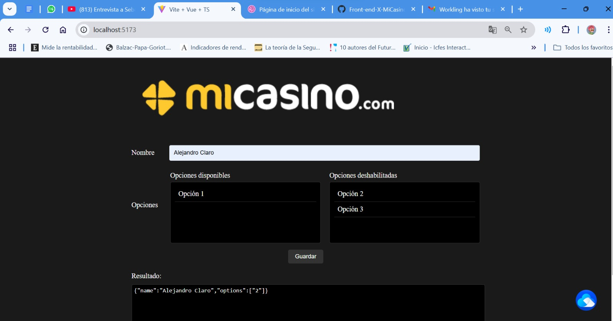

# Prueba MiCasino

# Prueba MiCasino

Este repositorio contiene un formulario modular para la aplicación MiCasino.

## Requisitos

- Node.js
- npm

## Instalación

1. Clona el repositorio:
   ```bash
   git clone <URL_DEL_REPOSITORIO>
   cd <NOMBRE_DEL_REPOSITORIO>
   ```

2. Instala las dependencias:
   ```bash
   npm install
   ```

## Ejecución

Para iniciar la aplicación, ejecuta:



